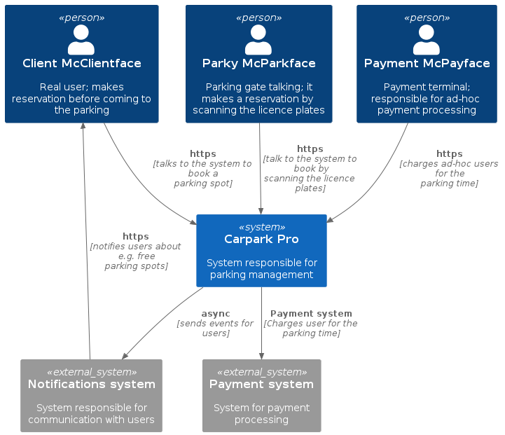
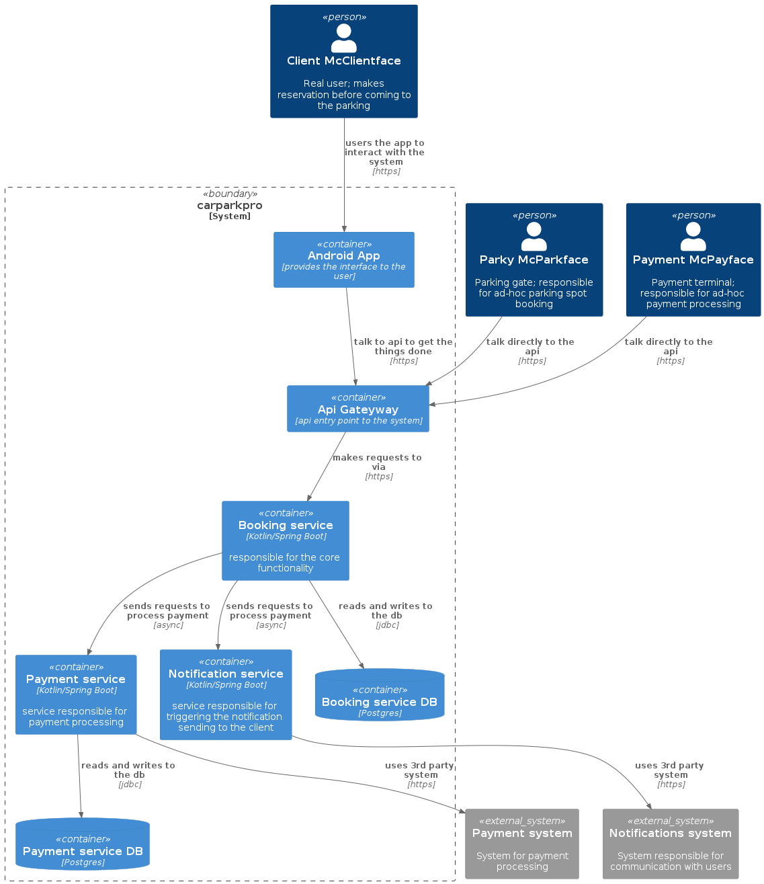

### Simple car parking system

Pet project of a simple parking system developed with the help of Kotlin, DDD and hexagonal architecture.

### Problem description

Park Co. is a revolutionary parking system which plan to transform the parking industry. Instead of investing massive amount of money into building a large,
multi-storage buildings, company plans to adapt unused pieces of real estate and turn them into mini-parking spaces.

Every piece of land will be mapped into a specific number of parking spots, which in turn could be booked for a specific amount of time for a fee. 
All the communication will happen digitally. Clients will have to either register their vehicle through the app or the vehicle's licence plates will be
scanned on entry, if the parking spot will be free, and the client will have to add the phone number during checkout. 

People can book a spot straight away if it's free or should be notified if any of the parking spots in the area of their choice will be free.

### Analysis
What does the system do? 

Core:
- let the client book the spot for some period of time
- process payments for the booking

Gate:
- verifies at the gate the reservation was made by scanning the licence plate
- if reservation was not made beforehand, it checks if there are free parking spots and, if yes, binds the licence place with the spot; when the client wants to leave, it prompts the client for the phonenumber and let the user pay  
- keeps track of the available parking spots

Payment terminal:
- payment terminals process payments for ad-hoc users

Notifications:
- notifies user when the parking is about to expire
- notifies user when there is a parking spot in the interested area/parking lot

### System architecture (C4 diagrams)

